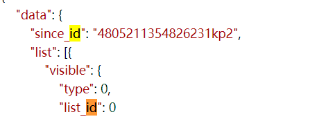

## 个人信息

个签、关注、粉丝、性别、地址，帖子数=data=>user=>statuses_count

https://weibo.com/ajax/profile/info?uid=539654439


信誉、学校、生日等

https://weibo.com/ajax/profile/detail?uid=5396544393


side: 粉丝群、关注推荐

https://weibo.com/ajax/profile/sidedetail?uid=5396544393


## 帖子

> 文字内容+时间


帖子链接

https://weibo.com/ajax/statuses/mymblog?uid=1669879400&page=1&feature=0

访问下一页会有一个新的参数

```python
data['data']['list'][0]['user']['screen_name'] # 帖子的用户名
```

`data=>since_id=4778405759554226kp3`

data=>list=>{index}=>created_at=`时间`

data=>list=>{index}=>text_raw=`文字内容`

data=>list=>{index}=>reposts_count=转发数

data=>list=>{index}=>comments_count=评论数

data=>list=>{index}=>attitudes_count=点赞数

data=>list=>{index}=>retweeted_status=转发的内容

data=>list=>{index}=>repost_type=是否转发(1是0否)?share_repost_type

| id   | username | target | time | text | stance |
| ---- | -------- | ------ | ---- | ---- | ------ |
|      |          |        |      |      |        |
|      |          |        |      |      |        |
|      |          |        |      |      |        |

每一页是20个帖子




"attitudes_count": 3655718 点赞数

data=>list=>index=>topic_struct=>index=>topic_title 话题 

贴子中的图片

https://wx1.sinaimg.cn/orj360/001P0DUIly1h7zzc39t99j60zk1bfe8102.jpg

图片的id可以在上面链接的响应中得到


每月是否发帖

https://weibo.com/ajax/profile/mbloghistory?uid=5396544393

## 搜索

"https://m.weibo.cn/search?containerid=100103type=1&q=迪丽热巴"

`q=要搜索的内容，containerid暂且不清楚但是必须`


## 脚本

获取info=>循环爬取blog=>下一个uid
